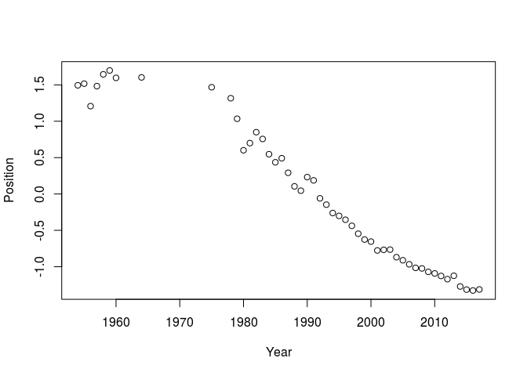

Chinese Stop words: Baidu Stopwords
-----------------------------------

``` r
require(readtext)
#> Loading required package: readtext
require(stringi)
#> Loading required package: stringi
require(quanteda)
#> Loading required package: quanteda
#> quanteda version 0.9.9.50
#> Using 7 of 8 cores for parallel computing
#> 
#> Attaching package: 'quanteda'
#> The following object is masked from 'package:utils':
#> 
#>     View

#read Chinese stop words
csw <- readtext("/datadrive/GData/ChineseStopWords.txt")
csw <- unlist(as.list(tokens(csw$text, remove_punct=T)))

# an example of using csw
removeFeatures(tokens("中华人民共和国成立于1949 年"), csw)
#> tokens from 1 document.
#> Component 1 :
#> [1] "中华"   "人民"   "共和国" "成立"   "1949"
```

Example application on a set of text files in Chinese
-----------------------------------------------------

49 "REPORT ON THE WORK OF THE GOVERNMENT" by Premier of the State Council, 1954 - 2017

``` r
#read text files
ctxt<-readtext("/datadrive/GData/政府工作报告/*.txt")

#create corpus
chCorpus <- corpus(ctxt)
summary(chCorpus)
#> Corpus consisting of 49 documents.
#> 
#>                              Text Types Tokens Sentences
#>       1954政府工作报告_周恩来.txt  2230  14093       453
#>       1955政府工作报告_李富春.txt  3053  35127       981
#>       1956政府工作报告_李先念.txt  1514  13164       495
#>       1957政府工作报告_周恩来.txt  2585  21737       704
#>       1958政府工作报告_薄一波.txt  2185  15164       412
#>       1959政府工作报告_周恩来.txt  2512  19217       577
#>       1960政府工作报告_谭震林.txt  1302   6268       164
#>  1964政府工作报告_周恩来_摘要.txt  1892  11676       387
#>       1975政府工作报告_周恩来.txt   966   3187       125
#>       1978政府工作报告_华国锋.txt  2964  19119       659
#>       1979政府工作报告_华国锋.txt  2655  17335       505
#>       1980政府工作报告_姚依林.txt  1453   8377       342
#>       1981政府工作报告_赵紫阳.txt  2845  20135       671
#>       1982政府工作报告_赵紫阳.txt  2722  18464       585
#>       1983政府工作报告_赵紫阳.txt  2492  14093       487
#>       1984政府工作报告_赵紫阳.txt  2197  11488       413
#>       1985政府工作报告_赵紫阳.txt  1709   9027       292
#>       1986政府工作报告_赵紫阳.txt  2372  16625       481
#>       1987政府工作报告_赵紫阳.txt  2118  13495       405
#>         1988政府工作报告_李鹏.txt  2647  18089       653
#>         1989政府工作报告_李鹏.txt  2418  15364       553
#>         1990政府工作报告_李鹏.txt  2613  16307       588
#>         1991政府工作报告_李鹏.txt  1598  16191       622
#>         1992政府工作报告_李鹏.txt  1969   9700       389
#>         1993政府工作报告_李鹏.txt  2195  11712       495
#>         1994政府工作报告_李鹏.txt  1951   9505       375
#>         1995政府工作报告_李鹏.txt  2081   9628       380
#>         1996政府工作报告_李鹏.txt  2095  12010       504
#>         1997政府工作报告_李鹏.txt  2131  10361       466
#>         1998政府工作报告_李鹏.txt  2007  10350       429
#>       1999政府工作报告_朱镕基.txt  2051   9633       388
#>       2000政府工作报告_朱镕基.txt  1951   9510       436
#>       2001政府工作报告_朱镕基.txt  1823   9607       476
#>       2002政府工作报告_朱镕基.txt  1971   9527       485
#>       2003政府工作报告_朱镕基.txt  2276  14729       731
#>       2004政府工作报告_温家宝.txt  1907  10399       468
#>       2005政府工作报告_温家宝.txt  1954  11227       553
#>       2006政府工作报告_温家宝.txt  2132  12774       574
#>       2007政府工作报告_温家宝.txt  2140  12404       544
#>       2008政府工作报告_温家宝.txt  2411  14697       673
#>       2009政府工作报告_温家宝.txt  2164  12200       592
#>       2010政府工作报告_温家宝.txt  2186  12337       600
#>       2011政府工作报告_温家宝.txt  2219  12156       530
#>       2012政府工作报告_温家宝.txt  2157  11293       516
#>       2013政府工作报告_温家宝.txt  1951   9486       318
#>       2014政府工作报告_李克强.txt  2378  10623       501
#>       2015政府工作报告_李克强.txt  2459  11412       508
#>       2016政府工作报告_李克强.txt  2565  12365       591
#>       2017政府工作报告_李克强.txt  2501  11758       548
#> 
#> Source:  /home/wangh52/quanteda_2/tests/misc/* on x86_64 by wangh52
#> Created: Thu Apr 20 18:25:24 2017
#> Notes:

#tokenize
chtoks <- tokens(ctxt$text, remove_punct = TRUE)
chtoks <- removeFeatures(chtoks, csw)

#dfm
chdfm <- dfm(chtoks)
topfeatures(chdfm)
#> 发展 经济 社会 建设 改革 人民 主义 工作 企业 国家 
#> 5627 5036 4255 4248 2931 2897 2817 2642 2627 2595
#发展 经济 社会 建设 改革 人民 主义 工作 企业 国家 
#5627 5036 4255 4248 2931 2897 2817 2642 2627 2595 

# plot a word cloud
set.seed(100)
chdfm_tf <- dfm_trim(chdfm, min_count = 500)
textplot_wordcloud(chdfm_tf, min.freq = 6, random.order = FALSE,
                   rot.per = .25, 
                   colors = RColorBrewer::brewer.pal(8,"Dark2"))
```


### Feature co-occurrence matrix

``` r
#fcm within the same ducuments
ch17txt <- readtext("/datadrive/GData/政府工作报告/2017*.txt")
ch17toks <- tokens(ch17txt$text, remove_punct = TRUE)
ch17toks <- removeFeatures(ch17toks, csw)
chfcm <- fcm(ch17toks)

#fcm within window
chfcm <- fcm(ch17toks, context = "window")  # default window size = 5
topfeatures(chfcm["改革", ])
#> 推进 制度   性 体制 完善   试   点 供给   侧 结构 
#>   23   19   11   11   10    8    8    7    7    7

# fcm within window: "改革"+ “xx”
chfcm <- fcm(ch17toks, context = "window", ordered = TRUE, tri = FALSE)  # default window size = 5
topfeatures(chfcm["改革", ])
#> 完善 发展   试   点 制度 全面 推进 深化 社会 开放 
#>   10    8    8    8    8    7    7    6    5    5
```

### Scaling Model

``` r
wfm <- textmodel_wordfish(chdfm)
y <- 1954:2017
y<-y[-which(y==1963 | y==1961 |y==1962 | (y>1964 & y<1975) | y==1976 |y==1977)]
dev.off()
#> null device 
#>           1
plot(y, wfm@theta, xlab = "Year", ylab = "Position")
```


Issues: English version vs. Chinese version
-------------------------------------------

``` r
en17txt <- readtext("/datadrive/GData/ch_gov_report-2017.txt")
en17toks <- tokens(en17txt$text, remove_punct = TRUE)
en17toks <- removeFeatures(en17toks, stopwords(kind = "english"))

topfeatures(dfm(ch17toks))
#> 发展 改革 经济 推进 建设   性 社会 政策 全面 企业 
#>  123   83   70   64   56   49   48   45   44   44
topfeatures(dfm(en17toks))
#>        will development        work      people     improve  government 
#>         405         108          75          74          73          72 
#>         new       areas       china      reform 
#>          67          61          58          56
```

### Segmentation issues

``` r
head(kwic(ch17toks, "性", window = 3))
#>                                                     
#>  [text1, 266]     供给 侧 结构 | 性 | 改革 初 成效  
#>  [text1, 509] 取得 一系列 开创 | 性 | 引领 性 机制  
#>  [text1, 511]     开创 性 引领 | 性 | 机制 性 重要  
#>  [text1, 513]     引领 性 机制 | 性 | 重要 成果 全球
#>  [text1, 547]   加剧 地区 全球 | 性 | 挑战 突发 发  
#>  [text1, 557]   的是 国内 结构 | 性 | 问题 突出 风险
```

供给 侧 结构 | 性 | 改革 初 成效 initial success was achieved in supply-side structural reform.

### Translation issues

China： 我国 我们 国内 国家 全国....
